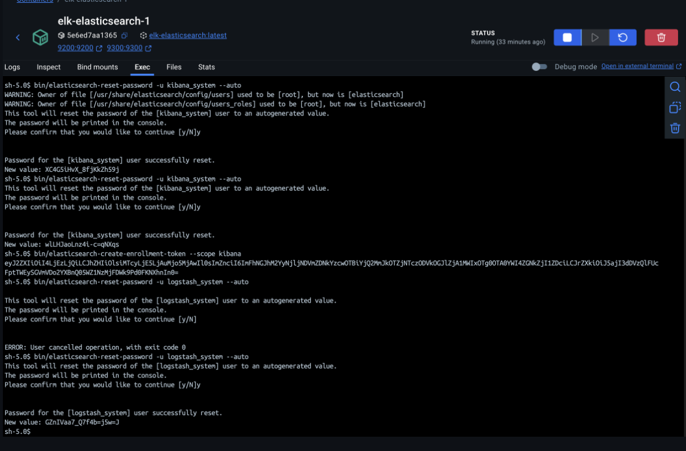
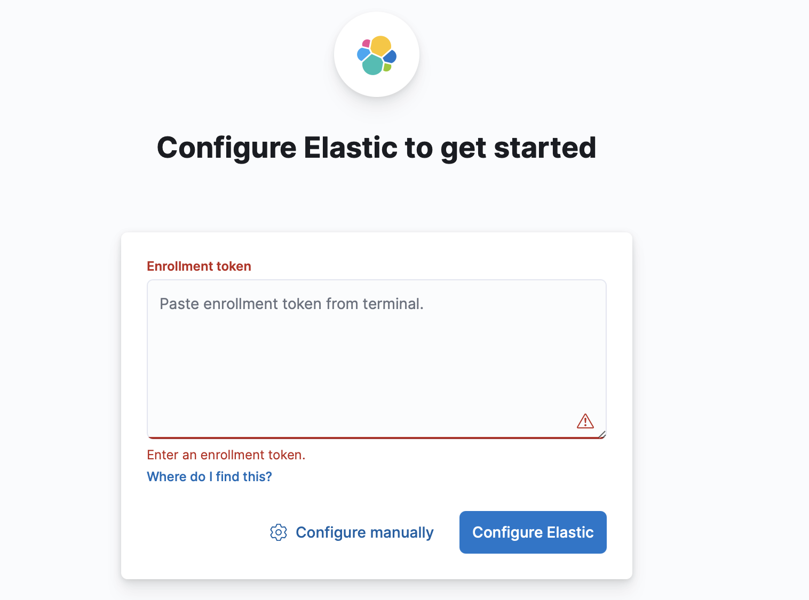
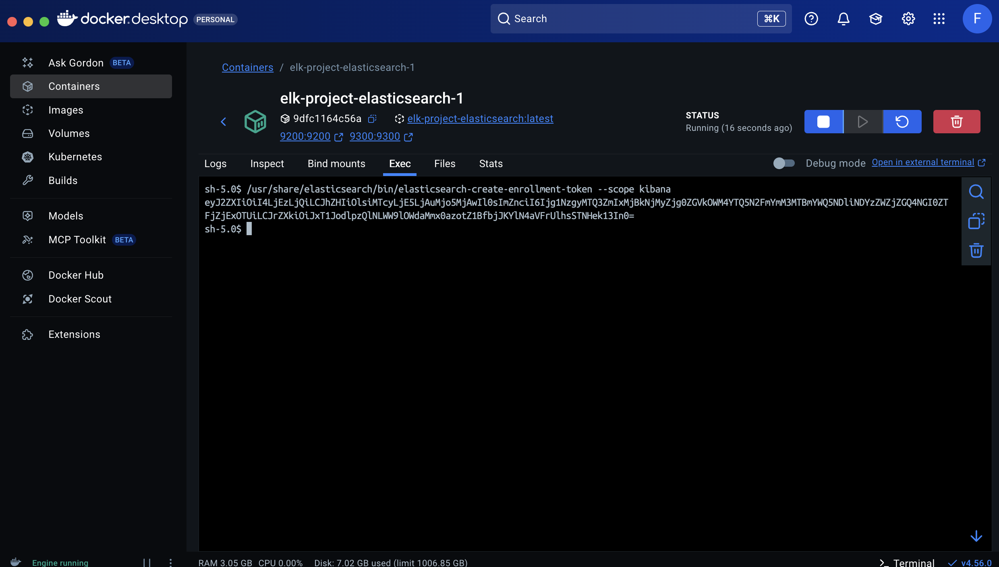
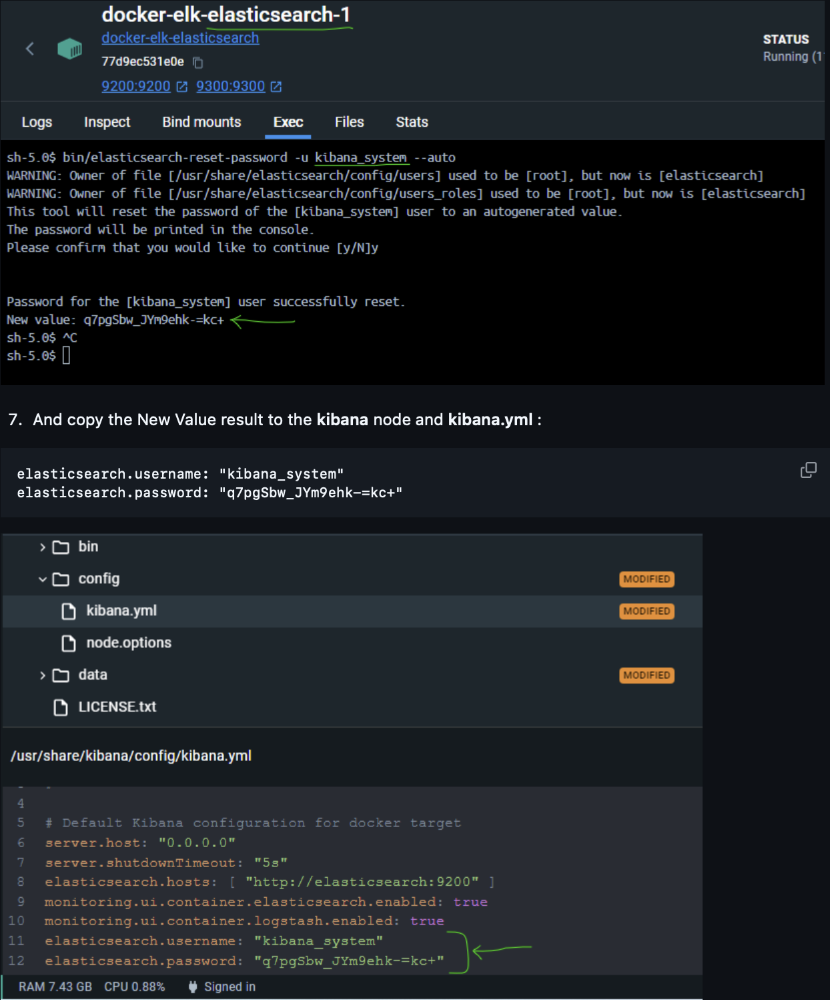
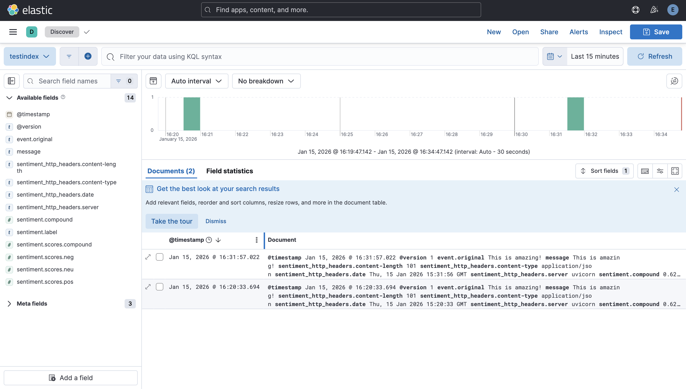

#  Elasticsearch, Kibana; Logstash (ELK Stack) with Docker Compose
## Q1 setup of ELK stack
1) Pull the all related docker **images** :
```bash
docker pull docker.elastic.co/elasticsearch/elasticsearch:8.13.4
docker pull docker.elastic.co/kibana/kibana:8.13.4
docker pull docker.elastic.co/logstash/logstash:8.13.4
```

2) Write the **Docker Compose** file :
```yaml
version: '3.7'

services:

  # The 'setup' service runs a one-off script which initializes users inside
  # Elasticsearch — such as 'logstash_internal' and 'kibana_system' — with the
  # values of the passwords defined in the '.env' file. It also creates the
  # roles required by some of these users.
  #
  # This task only needs to be performed once, during the *initial* startup of
  # the stack. Any subsequent run will reset the passwords of existing users to
  # the values defined inside the '.env' file, and the built-in roles to their
  # default permissions.
  #
  # By default, it is excluded from the services started by 'docker compose up'
  # due to the non-default profile it belongs to. To run it, either provide the

  setup:
    profiles:
      - setup
    build:
      context: setup/
      args:
        ELASTIC_VERSION: ${ELASTIC_VERSION}
    init: true
    volumes:
      - ./setup/entrypoint.sh:/entrypoint.sh:ro,Z
      - ./setup/lib.sh:/lib.sh:ro,Z
      - ./setup/roles:/roles:ro,Z
    environment:
      ELASTIC_PASSWORD: ${ELASTIC_PASSWORD:-}
      LOGSTASH_INTERNAL_PASSWORD: ${LOGSTASH_INTERNAL_PASSWORD:-}
      KIBANA_SYSTEM_PASSWORD: ${KIBANA_SYSTEM_PASSWORD:-}
      METRICBEAT_INTERNAL_PASSWORD: ${METRICBEAT_INTERNAL_PASSWORD:-}
      FILEBEAT_INTERNAL_PASSWORD: ${FILEBEAT_INTERNAL_PASSWORD:-}
      HEARTBEAT_INTERNAL_PASSWORD: ${HEARTBEAT_INTERNAL_PASSWORD:-}
      MONITORING_INTERNAL_PASSWORD: ${MONITORING_INTERNAL_PASSWORD:-}
      BEATS_SYSTEM_PASSWORD: ${BEATS_SYSTEM_PASSWORD:-}
    networks:
      - elk
    depends_on:
      - elasticsearch

  elasticsearch:
    build:
      context: elasticsearch/
      args:
        ELASTIC_VERSION: ${ELASTIC_VERSION}
    volumes:
      #- ./elasticsearch/config/elasticsearch.yml:/usr/share/elasticsearch/config/elasticsearch.yml:ro,Z
      - elasticsearch:/usr/share/elasticsearch/data:Z
    ports:
      - 9200:9200
      - 9300:9300
    environment:
      node.name: elasticsearch
      ES_JAVA_OPTS: -Xms512m -Xmx512m
      # Bootstrap password.
      # Used to initialize the keystore during the initial startup of
      # Elasticsearch. Ignored on subsequent runs.
      ELASTIC_PASSWORD: ${ELASTIC_PASSWORD:-}
      # Use single node discovery in order to disable production mode and avoid bootstrap checks.
      # see: https://www.elastic.co/guide/en/elasticsearch/reference/current/bootstrap-checks.html
      discovery.type: single-node
    networks:
      - elk
    restart: unless-stopped

  logstash:
    build:
      context: logstash/
      args:
        ELASTIC_VERSION: ${ELASTIC_VERSION}
    volumes:
      #- ./logstash/config/logstash.yml:/usr/share/logstash/config/logstash.yml:ro,Z
      - ./logstash/pipeline:/usr/share/logstash/pipeline:ro,Z
    ports:
      - 5044:5044
      - 50000:50000/tcp
      - 50000:50000/udp
      - 9600:9600
    environment:
      LS_JAVA_OPTS: -Xms256m -Xmx256m
      LOGSTASH_INTERNAL_PASSWORD: ${LOGSTASH_INTERNAL_PASSWORD:-}
    networks:
      - elk
    depends_on:
      - elasticsearch
    restart: unless-stopped

  kibana:
    build:
      context: kibana/
      args:
        ELASTIC_VERSION: ${ELASTIC_VERSION}
    #volumes:
    #  - ./kibana/config/kibana.yml:/usr/share/kibana/config/kibana.yml:ro,Z
    ports:
      - 5601:5601
    environment:
      KIBANA_SYSTEM_PASSWORD: ${KIBANA_SYSTEM_PASSWORD:-}
    networks:
      - elk
    depends_on:
      - elasticsearch
    restart: unless-stopped

networks:
  elk:
    driver: bridge

volumes:
  elasticsearch:

```

3) Start your deployment without 'Setup' service (**manual** deployment) :
```bash
docker compose up
```
then you must do this for only one time (mac users):
in  "/etc/hosts" Edit it with:
  - sudo nano /etc/hosts
  - Add this line: 127.0.0.1 elasticsearch.
4) elastic  container you need to excute to get the token
```bash
sh-5.0$ bin/elasticsearch-create-enrollment-token --scope kibana
```
after pasting it in the login of the kibana. you will prompted to enter another verification code and this you will find it in the kibana container logs

6) example of we can get passowrds and login informations from elastic container :


7) to check if logstesh is working we need to fetch for the localhost:9600


if you got this 

go to your docker desktop and on the elasticsearch container run this
command : sh-5.0$ /usr/share/elasticsearch/bin/elasticsearch-create-enrollment-token --scope kibana

and you will get this 

if you prompted to get confirmation code you will find it in kibana container output as its shown in the figure below


7) Login to the GUI (this for kibana but same exact job should be done with logstash container), following are the steps and illustrations:
  - On the elasticsearch node, write the below command : bin/elasticsearch-reset-password -u kibana_system --auto
  - And copy the New Value result to the kibana node and kibana.yml :
    - elasticsearch.username: "kibana_system"
    - elasticsearch.password: "q7pgSbw_JYm9ehk-=kc+"
  -  go to the kibana portal : Get the elastic node healthy info from kibana : "GET /_cluster/health?pretty"

## Q2 
sentiment-api folder holds app.py and inside it a fast api client that uses sentiment vader from nltk [check the doc](https://www.nltk.org/_modules/nltk/sentiment/vader.html)
to test:
on bash cd sentiment-api and excute : uvicorn app:app --host 0.0.0.0 --port 8000
to test it now excute the following:
curl -s http://localhost:8000/health
curl -s -X POST http://localhost:8000/predict \
  -H "Content-Type: application/json" \
  -d '{"text":"This is amazing!"}'

you will get as result a json looks like this :
{"ok":true}{"label":"positive","compound":0.6239,"scores":{"neg":0.0,"neu":0.328,"pos":0.672,"compound":0.6239}}

### Q2 - verify ELK integration (Logstash -> sentiment-api -> Elasticsearch)
1) Start the stack:
```bash
docker compose -f elk-project/Docker-compose.yml up -d
```

2) Send a test message through Logstash TCP input (port 50000):
```bash
printf 'This is amazing!\n' | nc -w 1 localhost 50000
```

3) Check Elasticsearch for the sentiment field (index: `testindex`):
```bash
export ELASTIC_PASSWORD='your_elastic_password'
curl -s -u elastic:${ELASTIC_PASSWORD} "http://localhost:9200/testindex/_search?q=message:amazing&pretty"
```

You should see a document containing a `sentiment` object with `label` and `compound` fields.

4) Kibana UI check:
- Open `http://localhost:5601`
- Create a data view for `testindex`
- Discover -> verify fields `sentiment.label`, `sentiment.compound`, and `message`

## Q3
Implémentez en utilisant python3 un connecteur Facebook et/ou Instagram permettant de colleter des postes (image, texte et commentaires liés aux images) par rapport à un sujet défini, exemple « le décès du président Jacques Chirac ».

Il est recommandé de stocker les textes et les images dans une base MongoDB. Le but de cette question est d’évaluer la qualité de votre code source
